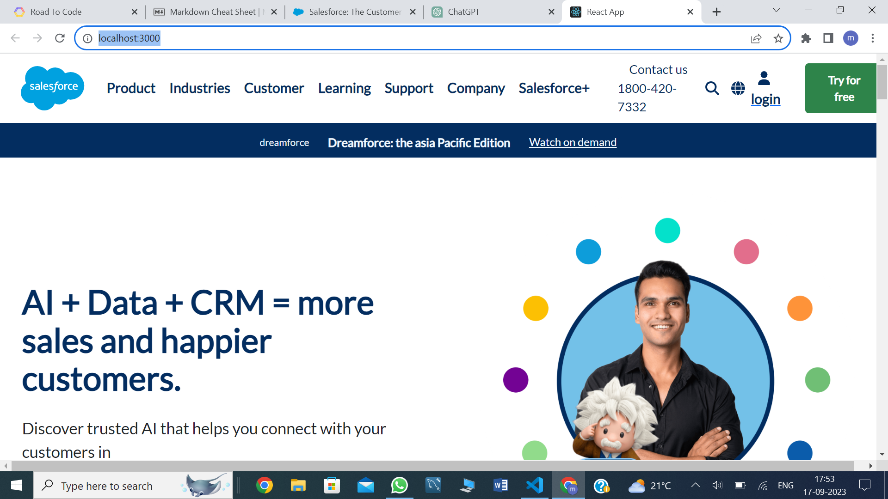

# SALESFORCE CLONE 

**This is Salesforce clone project** .
 Salesforce is a cloud-based customer relationship management (CRM) platform that helps organizations manage their sales, customer service, marketing, and other business operations .
 It is one of the leading CRM software providers globally and is known for its versatility and scalability. Here are some key aspects of Salesforce:

 This Salesforce clone is developed by using technology 
 - HTML
 - CSS
 - JAVASCRIPT
 - **REACT**

 

 This project is clone of original website
[Salesforce](https://www.salesforce.com/in/?ir=1)
U can visit and see how exactly same website we developed using our coding skills.
 
## Details about this project

This project is developed using front-end technolgy.
this website is fully responsive and u can visit it from any online source mobile ,laptop,tablet ,desktop size computers, etc.
 
 This website include 25 pages & all the pages and component are fully design and respnsive.

 This project is lead by <b>Ms.Chandrajyoti Adil</b>
 and other 3 group members .
 

